<h1 align="center">CMOS Analog IC Design · ITI</h1>

<p align="center">
  <b>Labs · Mini projects · Design challenges · Reports · Papers</b><br>
  My complete work from the Analog IC Design (CMOS Technology) summer training at the Information Technology Institute (ITI).
</p>

<p align="center">
  
  
  
  
  
</p>

<p align="center">
  <a href="https://mohammed-nasr-aldin.github.io/ITI-Analog-Design">
    
  </a>
</p>

<p align="center">
  
</p>

<p align="center"><sub><i>Left of the scan line is the cleaned output, right of it is the raw input. That is the whole job of an analog designer: keep the signal, fight the noise, mismatch, and variation. <a href="signal-animation/">How the banner works</a>.</i></sub></p>

---

## 📑 Table of contents

1. [🌐 Live site](#live-site)
2. [📖 Overview](#overview)
3. [🗂️ Repository structure](#repository-structure)
4. [🎓 Master Micro course](#master-micro-course)
5. [🧪 Labs](#labs)
6. [🛠️ Mini projects](#mini-projects)
7. [🏆 Design challenges](#design-challenges)
8. [🔊 Noise assignment](#noise-assignment)
9. [🧭 Design methodology](#design-methodology)
10. [🧰 Tools and technologies](#tools-and-technologies)
11. [📚 References](#references)
12. [🏅 Certificate](#certificate)
13. [📜 MIT License](#license)
14. [🙏 Acknowledgments](#acknowledgments)
15. [📬 Contact](#contact)

---

## <a id="live-site"></a>🌐 Live site

Everything in this repository is also browsable as a website: reports open in the page, figures are one click away, and hand calculations sit next to simulation results.

<p align="center">
  <a href="https://mohammed-nasr-aldin.github.io/ITI-Analog-Design">
    
  </a>
</p>

<table align="center">
  <thead>
    <tr>
      <th align="center">🛠️ Projects</th>
      <th align="center">🧪 Labs</th>
      <th align="center">🏆 Design challenges</th>
    </tr>
  </thead>
  <tbody>
    <tr>
      <td align="center" valign="top">The two mini projects with a schematic viewer, an image carousel, and a hand-vs-simulation table with the error</td>
      <td align="center" valign="top">Every lab report with search and topic filters, key results at a glance, and the Lab 05 Monte Carlo histograms with CSV downloads</td>
      <td align="center" valign="top">The rail-to-rail op-amp, the bandgap reference, and the noise assignment with the original problem</td>
    </tr>
  </tbody>
</table>

<p align="center"><sub>Plus live waveform demos (gain clipping, damping, PTAT trim), an interactive <b>gm/ID explorer</b>, and an in-page PDF viewer.</sub></p>

<details>
<summary><b>💻 Run the website locally</b></summary>

<br>

```bash
cd website
npm install
npm run dev
```

The site reads PDFs, images, and CSV files straight from the folders in this repository (labs, projects, design challenges, noise assignment, certificate, logos), so anything added there shows up after a restart of the dev server.

</details>

[⬆️ Back to top](#readme)

---

## <a id="overview"></a>📖 Overview

This repository is my complete record of the **Analog IC Design (CMOS Technology)** track at ITI, a summer training that ran from **15 July to 9 September** and was supervised by **Dr. Hesham Omran**. It goes from an RC circuit and MOSFET characteristics all the way to a fully differential folded-cascode OTA with common-mode feedback.

What is inside:

- 🧪 **12 labs** (00 to 11): ten written up as PDF reports with hand calculations compared against simulation, plus Lab 09 and Lab 11 which grew into the two mini projects.
- 🛠️ **2 mini projects** (Lab 09 and Lab 11): a two-stage Miller OTA and a fully differential folded-cascode OTA.
- 🏆 **2 design challenges**: a full-custom rail-to-rail op-amp in 65 nm and a bandgap reference (BGR).
- 🔊 **noise assignment** (Johns & Martin, Example 9.10).
- 📄 **2 papers** used as design references, plus screenshots, Monte Carlo data, and the certificate.
- 🌐 **A website** that presents all of the above.

The content was built from several sources: **Razavi**, **Johns & Martin**, **Sedra & Smith**, the course lectures, and the papers listed in [References](#references).

> 💡 **How every report is organized:** specs, then hand analysis and sizing (gm/ID with ADT), then simulation, then a table comparing the two with the error, then comments explaining the difference.

[⬆️ Back to top](#readme)

---

## <a id="repository-structure"></a>🗂️ Repository structure

```text
.
├── LICENSE                               # MIT License
├── README.md
│
├── website/                              # source of the live site (React + Vite)
│   ├── src/
│   │   ├── App.jsx                       # pages, data, and interactive demos
│   │   └── index.css                     # styles
│   └── …                                 # package.json, index.html, config
│
├── certificate/
│   └── ITI-AIC.jpeg                      # completion certificate
│
├── ITI-Labs/                             # lab reports (Lab 09 and Lab 11 are the mini projects)
│   ├── lab00.pdf … lab08.pdf
│   ├── lab10.pdf
│   └── lab05-monte-carlo-simulation/     # histograms + raw CSV data (200 runs)
│
├── projects/
│   ├── project1/                         # = Lab 09: two-stage Miller OTA
│   │   ├── *.png                         # schematic, Ao, CMRR
│   │   └── report/
│   └── project2/                         # = Lab 11: fully differential folded-cascode OTA
│       ├── *.png                         # schematic, CMFB, Ao, Vod
│       ├── paper/                        # folded_current_split.pdf
│       └── report/
│
├── design-challenges/
│   ├── op-amp/                           # full-custom rail-to-rail op-amp (65 nm)
│   │   ├── *.png
│   │   ├── paper/                        # hogervorst1994.pdf
│   │   └── report/
│   └── BGR/                              # bandgap reference
│       ├── *.png
│       └── report/
│
├── noise-assignment/
│   ├── noise-assignment.pdf              # Johns & Martin, Ex. 9.10
│   └── problem.jpg                       # the problem statement
│
├── signal-animation/
│   ├── README.md
│   └── signal-banner.svg                 # the banner at the top of this page
│
└── logos/
    ├── ITI-logo.svg                      # ITI
    ├── -logos.svg                   # xschem, Cadence, ADT
    └── mastermicro-logo.jpeg             # Master Micro
```

<table align="center">
  <thead>
    <tr>
      <th align="center">Folder</th>
      <th align="center">What you will find</th>
    </tr>
  </thead>
  <tbody>
    <tr>
      <td align="center">🌐 <a href="website/"><code>website</code></a></td>
      <td align="center">Source code of the live site, which reads its content from the folders below</td>
    </tr>
    <tr>
      <td align="center">🧪 <a href="ITI-Labs/"><code>ITI-Labs</code></a></td>
      <td align="center">Lab reports 00 to 08 and 10, plus the Lab 05 Monte Carlo results</td>
    </tr>
    <tr>
      <td align="center">🛠️ <a href="projects/"><code>projects</code></a></td>
      <td align="center">The two mini projects with reports, figures, and the paper for Project 2</td>
    </tr>
    <tr>
      <td align="center">🏆 <a href="design-challenges/"><code>design-challenges</code></a></td>
      <td align="center">The op-amp and BGR challenges with reports, figures, and the op-amp paper</td>
    </tr>
    <tr>
      <td align="center">🔊 <a href="noise-assignment/"><code>noise-assignment</code></a></td>
      <td align="center">Hand noise analysis of a low-pass filter around an op-amp, with the problem statement</td>
    </tr>
    <tr>
      <td align="center">📡 <a href="signal-animation/"><code>signal-animation</code></a></td>
      <td align="center">The animated SVG banner</td>
    </tr>
    <tr>
      <td align="center">🖼️ <a href="logos/"><code>logos</code></a></td>
      <td align="center">ITI, Master Micro, and tool logos used by the site and this page</td>
    </tr>
    <tr>
      <td align="center">🏅 <a href="certificate/"><code>certificate</code></a></td>
      <td align="center">ITI completion certificate</td>
    </tr>
  </tbody>
</table>

[⬆️ Back to top](#readme)

---

## <a id="master-micro-course"></a>🎓 Master Micro course

<p align="center">
  <a href="https://www.master-micro.com/home"></a>
</p>

The training content follows the <a href="https://www.master-micro.com/professional-courses/analog-ic-design"><b>Analog IC Design</b></a> course on <a href="https://www.master-micro.com/home"><b>Master Micro</b></a>, the course that helped many students break into the Analog IC Design industry. Everything in it is free: lecture videos, slides, and labs.

<table align="center">
  <thead>
    <tr>
      <th align="center">Section</th>
      <th align="center">What it covers</th>
    </tr>
  </thead>
  <tbody>
    <tr>
      <td align="center">ℹ️ <a href="https://www.master-micro.com/professional-courses/analog-ic-design/course-information"><b>Course Information</b></a></td>
      <td align="center">Prerequisites, course description, and why it is different</td>
    </tr>
    <tr>
      <td align="center">🗓️ <a href="https://www.master-micro.com/professional-courses/analog-ic-design/course-plan"><b>Course Plan</b></a></td>
      <td align="center">A suggested plan to organize the lectures and labs journey</td>
    </tr>
    <tr>
      <td align="center">🎬 <a href="https://www.master-micro.com/professional-courses/analog-ic-design/course-resources"><b>Course Resources</b></a></td>
      <td align="center">Links to course videos, lecture slides, labs, and more</td>
    </tr>
  </tbody>
</table>

<p align="center">
  🧮 The sizing in this repo is done with the <a href="https://adt.master-micro.com/"><b>Analog Designer's Toolbox (ADT)</b></a> from Master Micro.
</p>

[⬆️ Back to top](#readme)

---

## <a id="labs"></a>🧪 Labs

All lab reports use **180 nm CMOS (GF180) with VDD = 1.8 V** and sizing based on **ADT**. Every report ends with an analytical-versus-simulation comparison.

<table align="center">
  <thead>
    <tr>
      <th align="center">Lab</th>
      <th align="center">Topic</th>
      <th align="center">What was done and key results</th>
      <th align="center">Report</th>
    </tr>
  </thead>
  <tbody>
    <tr>
      <td align="center">00</td>
      <td align="center">🔁 <b>RLC circuits</b></td>
      <td align="center">Parallel and series RLC: impedance, resonance, Q, bandwidth, R sweeps, step-response damping. <code>f0</code> = 5.03 GHz analytical vs 5.018 GHz simulated. Q = 31.6 analytical vs 30.1 (parallel) and 30.8 (series) simulated</td>
      <td align="center"><a href="ITI-Labs/lab00.pdf">📄 PDF</a></td>
    </tr>
    <tr>
      <td align="center">01</td>
      <td align="center">🔬 <b>LPF and MOSFET characteristics</b></td>
      <td align="center"><i>Part 1:</i> RC low-pass filter (τ = 0.5 ns): rise time 1.104 ns vs 1.1 ns, f<sub>-3dB</sub> 317.6 MHz vs 318.3 MHz, pole-zero. <i>Part 2:</i> long channel (30 µm / 2 µm) vs short channel (3 µm / 200 nm): ID-VGS, gm-VGS, ID-VDS, velocity saturation, channel-length modulation. NMOS/PMOS current ratio 3.85 (long) vs 2.48 (short)</td>
      <td align="center"><a href="ITI-Labs/lab01.pdf">📄 PDF</a></td>
    </tr>
    <tr>
      <td align="center">02</td>
      <td align="center">📈 <b>Common-source amplifier</b></td>
      <td align="center">Sizing chart for Av = −8 at 100 µA: W = 34.5 µm, L = 2 µm, R<sub>D</sub> = 9 kΩ, V<sub>GS</sub> = 617 mV. Simulated gain −7.68. Gain non-linearity and linearization with feedback (linear input range 0.208 V vs 0.21 V analytical). PMOS load cuts the gm swing from 12 µS to 0.4 µS</td>
      <td align="center"><a href="ITI-Labs/lab02.pdf">📄 PDF</a></td>
    </tr>
    <tr>
      <td align="center">03</td>
      <td align="center">🗼 <b>Cascode amplifier</b></td>
      <td align="center">Sizing for gm·ro = 80 at 50 µA (L = 350 nm, W = 3.57 µm). <i>Cascode for gain:</i> 2111 (66.5 dB) vs 72 for CS, at the cost of BW (35.9 kHz vs 1.09 MHz) with nearly equal GBW. <i>Cascode for BW:</i> Miller reduction gives 3 MHz vs 1.69 MHz and GBW 25.1 vs 13.2 MHz</td>
      <td align="center"><a href="ITI-Labs/lab03.pdf">📄 PDF</a></td>
    </tr>
    <tr>
      <td align="center">04</td>
      <td align="center">🔋 <b>Common-drain (CD) buffer</b></td>
      <td align="center">ADT sizing (ID = 10 µA, gm/ID = 10, L = 1 µm, W = 19.36 µm). Q ≈ 2.3 gives 49.6 % overshoot and an inductive rise in Z<sub>out</sub>. Fixed with a load capacitor and then a compensation network (C1, R2, C2 from Johns &amp; Martin, Section 4.4): no ringing, no overshoot</td>
      <td align="center"><a href="ITI-Labs/lab04.pdf">📄 PDF</a></td>
    </tr>
    <tr>
      <td align="center">05</td>
      <td align="center">🪞 <b>Current mirrors</b></td>
      <td align="center">ADT sizing for mismatch &lt; 2 % and λ &lt; 0.1 V⁻¹ (V* = 150 mV, L = 1.42 µm, W = 14.6 µm, m = 2). R<sub>out</sub>: 1.585 MΩ (simple) vs 216 MΩ (wide-swing). Compliance ≈ 0.15 V vs 0.25 V. Mismatch-induced ΔI<sub>out</sub>: 2.27 % / 2.24 % / 0.016 % (simple / wide-swing / cascode). <b>200-run Monte Carlo:</b> 1.93 % vs 1.87 %</td>
      <td align="center"><a href="ITI-Labs/lab05.pdf">📄 PDF</a></td>
    </tr>
    <tr>
      <td align="center">06</td>
      <td align="center">⚖️ <b>Differential amplifier</b></td>
      <td align="center">PMOS input pair, I<sub>SS</sub> = 40 µA, R<sub>D</sub> = 30 kΩ. A<sub>vd</sub> = 7.81 vs 8 hand, BW = 5.7 MHz, |A<sub>vcm</sub>| = 0.039. CMIR 1.19 V with a simple mirror and 1.14 V with a wide-swing mirror, which also gives better low-frequency CMRR</td>
      <td align="center"><a href="ITI-Labs/lab06.pdf">📄 PDF</a></td>
    </tr>
    <tr>
      <td align="center">07</td>
      <td align="center">5️⃣ <b>Five-transistor OTA</b></td>
      <td align="center">NMOS input pair, gm/ID sizing, minimum area from an Area × I<sub>D</sub> plot. A<sub>vd</sub> = 34.25 dB, CMRR = 74.2 dB, GBW = 5 MHz at 5 pF, CMIR 0.64 V, 35.25 µA, 11.8 µm², loop-gain phase margin 89°</td>
      <td align="center"><a href="ITI-Labs/lab07.pdf">📄 PDF</a></td>
    </tr>
    <tr>
      <td align="center">08</td>
      <td align="center">🔄 <b>Negative feedback</b></td>
      <td align="center">Behavioral vs real OTA with C<sub>IN</sub> = 4 pF and 12 pF: closed-loop gain 5.68 dB and 11.37 dB (6 and 12 dB by hand), BW 2.65 MHz and 1.37 MHz, constant GBW ≈ 5.1 MHz. The real OTA is slower because of parasitics. Over temperature the closed-loop gain moves 0.73 % while the loop gain moves 16.6 % (gain desensitization)</td>
      <td align="center"><a href="ITI-Labs/lab08.pdf">📄 PDF</a></td>
    </tr>
    <tr>
      <td align="center">09</td>
      <td align="center">🛠️ <b>Mini Project 01</b></td>
      <td align="center">Two-stage Miller OTA</td>
      <td align="center"><a href="#project-1">➡️ See Project 1</a></td>
    </tr>
    <tr>
      <td align="center">10</td>
      <td align="center">🔊 <b>Noise simulation</b></td>
      <td align="center">RC low-pass: 4.07 nV/√Hz and 64.3 µV<sub>rms</sub> (kT/C), transient noise 63.5 µV<sub>rms</sub>. Five-transistor OTA: 15.15 nV/√Hz vs 14.83 hand, thermal rms 42.55 µV, flicker corner ≈ 1.65 MHz, transient noise 61 µV<sub>rms</sub></td>
      <td align="center"><a href="ITI-Labs/lab10.pdf">📄 PDF</a></td>
    </tr>
    <tr>
      <td align="center">11</td>
      <td align="center">🛠️ <b>Mini Project 02</b></td>
      <td align="center">Fully differential folded-cascode OTA</td>
      <td align="center"><a href="#project-2">➡️ See Project 2</a></td>
    </tr>
  </tbody>
</table>

### 🎲 Lab 05 · Monte Carlo results

Simple current mirror versus wide-swing current mirror, 200 runs each. Raw data: [`simpleCM-monteCarlo-data.csv`](ITI-Labs/lab05-monte-carlo-simulation/simpleCM-monteCarlo-data.csv) and [`wideSwingCM-monteCarlo-data.csv`](ITI-Labs/lab05-monte-carlo-simulation/wideSwingCM-monteCarlo-data.csv).

<table align="center">
  <tr>
    <td align="center">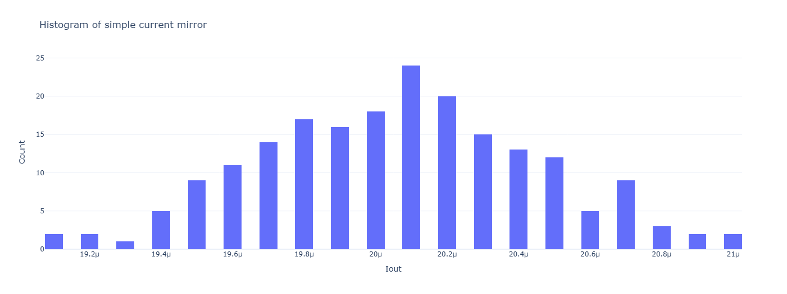<br><sub>Simple CM: 1.93 % error</sub></td>
    <td align="center">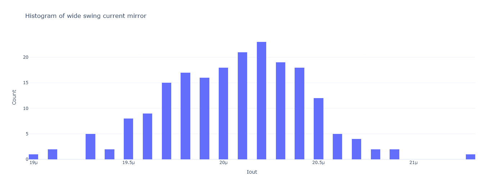<br><sub>Wide-swing CM: 1.87 % error</sub></td>
  </tr>
</table>

[⬆️ Back to top](#readme)

---

## <a id="mini-projects"></a>🛠️ Mini projects

Both projects follow the same flow: derive specs, extract design points from gm/ID charts (ADT), size every transistor, then verify in Cadence Virtuoso.

### <a id="project-1"></a>1️⃣ Project 1 · Two-stage Miller OTA (Lab 09)

**📄 Report:** [`two-stag-millier-OTA.pdf`](projects/project1/report/two-stag-millier-OTA.pdf)

<table align="center">
  <thead>
    <tr>
      <th align="center">Item</th>
      <th align="center">Value</th>
    </tr>
  </thead>
  <tbody>
    <tr>
      <td align="center">🔬 Technology</td>
      <td align="center">180 nm (GF180), single 1.8 V supply, 10 µA reference current</td>
    </tr>
    <tr>
      <td align="center">🧩 Topology</td>
      <td align="center">PMOS input pair, NMOS active load, NMOS second stage, NMOS voltage-controlled zero-nulling resistor</td>
    </tr>
    <tr>
      <td align="center">🔌 Load</td>
      <td align="center">5 pF</td>
    </tr>
    <tr>
      <td align="center">🎯 Targets</td>
      <td align="center">Static gain error ≤ 0.05 % (A<sub>ol</sub> ≥ 66 dB), CMRR ≥ 74 dB, SR = 5 V/µs, rise time ≤ 70 ns, output swing 0.2 V to 1.6 V, current &lt; 60 µA, and a phase-margin requirement</td>
    </tr>
  </tbody>
</table>

**🧠 Design decisions:**

- Gain split A<sub>v1</sub> = 65 and A<sub>v2</sub> = 55, with the larger gain in stage 1 because stage-2 noise is divided by the stage-1 gain when referred to the input.
- I<sub>B1</sub> = 10 µA and I<sub>B2</sub> = 40 µA so the non-dominant pole sits at about 3.2 × the unity-gain frequency (PM ≈ 73°). Total current 50 µA and total area 33.9 µm² (from ADT).
- The zero-nulling transistor has its gate tied to VDD and its body tied to GND, which removes the need for an extra bias branch.

<table align="center">
  <thead>
    <tr>
      <th align="center">Metric</th>
      <th align="center">Hand calculation</th>
      <th align="center">Simulation</th>
    </tr>
  </thead>
  <tbody>
    <tr>
      <td align="center">DC differential gain</td>
      <td align="center">70.24 dB</td>
      <td align="center"><b>73.43 dB</b></td>
    </tr>
    <tr>
      <td align="center">GBW</td>
      <td align="center">5.97 MHz</td>
      <td align="center"><b>5.52 MHz</b></td>
    </tr>
    <tr>
      <td align="center">CMRR</td>
      <td align="center">≥ 74 dB</td>
      <td align="center"><b>74.3 dB</b></td>
    </tr>
    <tr>
      <td align="center">Phase margin</td>
      <td align="center">73°</td>
      <td align="center"><b>73.12°</b></td>
    </tr>
    <tr>
      <td align="center">Slew rate, C<sub>c</sub> = 2 pF</td>
      <td align="center">5 V/µs</td>
      <td align="center">4.3 V/µs</td>
    </tr>
    <tr>
      <td align="center">Slew rate, C<sub>c</sub> = 1.665 pF</td>
      <td align="center">6 V/µs</td>
      <td align="center"><b>5 V/µs</b></td>
    </tr>
    <tr>
      <td align="center">CMIR</td>
      <td align="center">0.19 V to 0.8 V</td>
      <td align="center">0.1 V to 0.8 V (0.85 V by GBW)</td>
    </tr>
  </tbody>
</table>

C<sub>c</sub> was reduced from 2 pF to **1.665 pF**, the largest value that still meets the slew-rate spec, while keeping PM > 70°.

<table align="center">
  <tr>
    <td align="center">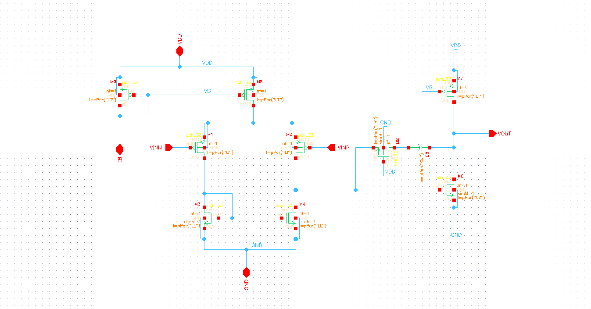<br><sub>Two-stage Miller OTA</sub></td>
    <td align="center">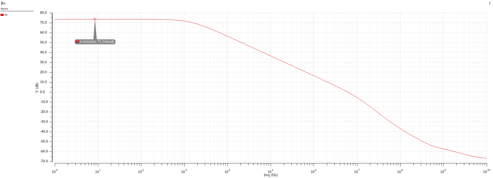<br><sub>Open-loop gain (Aol)</sub></td>
    <td align="center">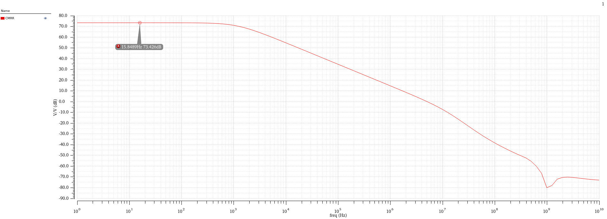<br><sub>CMRR</sub></td>
  </tr>
</table>

### <a id="project-2"></a>2️⃣ Project 2 · Fully differential folded-cascode OTA (Lab 11)

**📄 Report:** [`Fully-diff-OTA.pdf`](projects/project2/report/Fully-diff-OTA.pdf) · **📑 Paper:** [`folded_current_split.pdf`](projects/project2/paper/folded_current_split.pdf) (H. Omran, optimum current split ratio for folded-cascode OTAs)

<table align="center">
  <thead>
    <tr>
      <th align="center">Item</th>
      <th align="center">Value</th>
    </tr>
  </thead>
  <tbody>
    <tr>
      <td align="center">🔬 Technology</td>
      <td align="center">GF180 MCU (180 nm), 2.5 V supply, external 10 µA reference</td>
    </tr>
    <tr>
      <td align="center">🧩 Topology</td>
      <td align="center">PMOS input pair, folded cascode, current split S = 1, behavioral and actual CMFB</td>
    </tr>
    <tr>
      <td align="center">🔄 Feedback</td>
      <td align="center">Capacitive inverting amplifier, A<sub>cl</sub> = 2 (C<sub>S</sub> = 2 pF, C<sub>F</sub> = 1 pF, β = 1/3)</td>
    </tr>
    <tr>
      <td align="center">🎯 Targets</td>
      <td align="center">Loop gain ≥ 60 dB, PM ≥ 70°, differential output swing 1.2 V<sub>pp</sub>, 1 % settling in 100 ns</td>
    </tr>
  </tbody>
</table>

**🧠 Design decisions:**

- The 1 % settling requirement gives τ<sub>cl</sub> ≈ 21.7 ns, so the open-loop GBW must be ≈ 22 MHz, which sets g<sub>m1,2</sub> ≈ 170 µS.
- Input pair at L = 300 nm and gm/ID = 17 µS/µA, current sources at L = 1 µm and gm/ID = 10, cascodes at L = 0.5 µm and gm/ID = 15.
- Total active area 111.2 µm².

<table align="center">
  <thead>
    <tr>
      <th align="center">Metric</th>
      <th align="center">Behavioral CMFB</th>
      <th align="center">Actual CMFB</th>
    </tr>
  </thead>
  <tbody>
    <tr>
      <td align="center">Open-loop DC gain</td>
      <td align="center">77.09 dB</td>
      <td align="center">75.96 dB</td>
    </tr>
    <tr>
      <td align="center">Open-loop GBW</td>
      <td align="center">22.63 MHz</td>
      <td align="center">22.55 MHz</td>
    </tr>
    <tr>
      <td align="center">Open-loop phase margin</td>
      <td align="center">87.84°</td>
      <td align="center">87.85°</td>
    </tr>
  </tbody>
</table>

<table align="center">
  <thead>
    <tr>
      <th align="center">Closed-loop result</th>
      <th align="center">Value</th>
    </tr>
  </thead>
  <tbody>
    <tr>
      <td align="center">Closed-loop gain</td>
      <td align="center">1.999 (6.016 dB)</td>
    </tr>
    <tr>
      <td align="center">Differential loop gain / UGF / PM</td>
      <td align="center">66.41 dB / 7.5 MHz / 89.33°</td>
    </tr>
    <tr>
      <td align="center">CM loop PM (first pass)</td>
      <td align="center">56.4° (below target)</td>
    </tr>
    <tr>
      <td align="center">CM loop PM (after tuning CMFB input width to 0.5 µm)</td>
      <td align="center"><b>77.5°</b> at 69.19 dB</td>
    </tr>
    <tr>
      <td align="center">1 % settling time</td>
      <td align="center"><b>96.45 ns</b></td>
    </tr>
    <tr>
      <td align="center">Differential output swing</td>
      <td align="center">1.2 V<sub>pp</sub> from a 0.6 V<sub>pp</sub> input</td>
    </tr>
  </tbody>
</table>

<table align="center">
  <tr>
    <td align="center" colspan="2">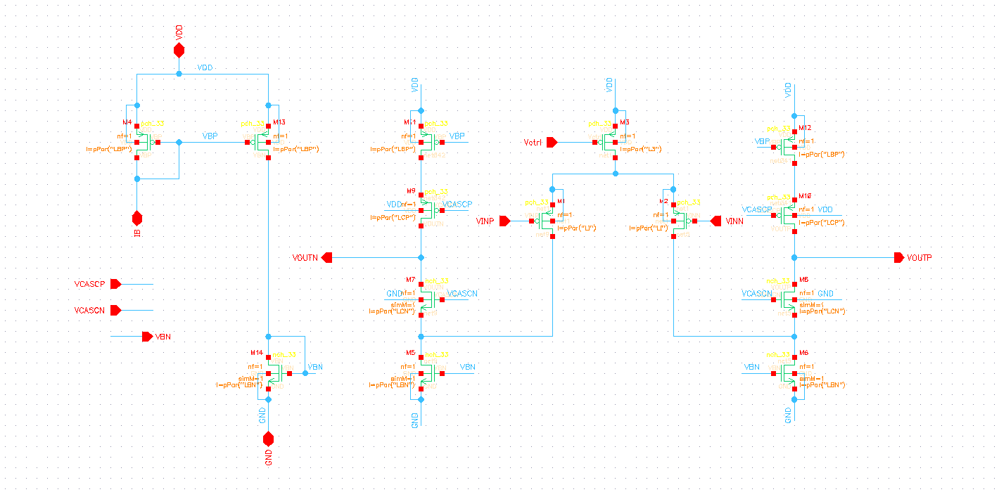<br><sub>Folded-cascode OTA</sub></td>
    <td align="center" colspan="2">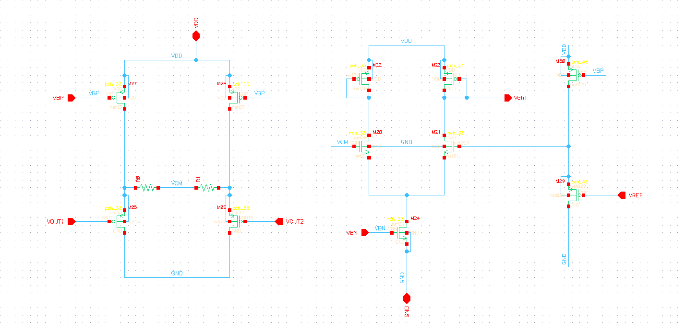<br><sub>CMFB</sub></td>
    <td align="center" colspan="2">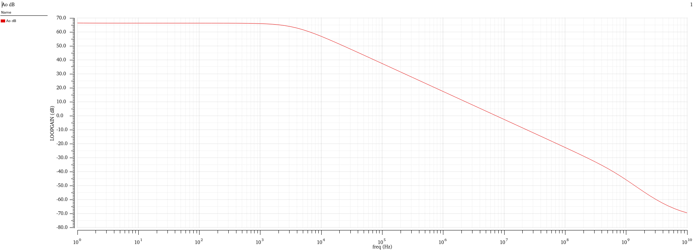<br><sub>Open-loop gain (Aol)</sub></td>
  </tr>
  <tr>
    <td align="center" colspan="3">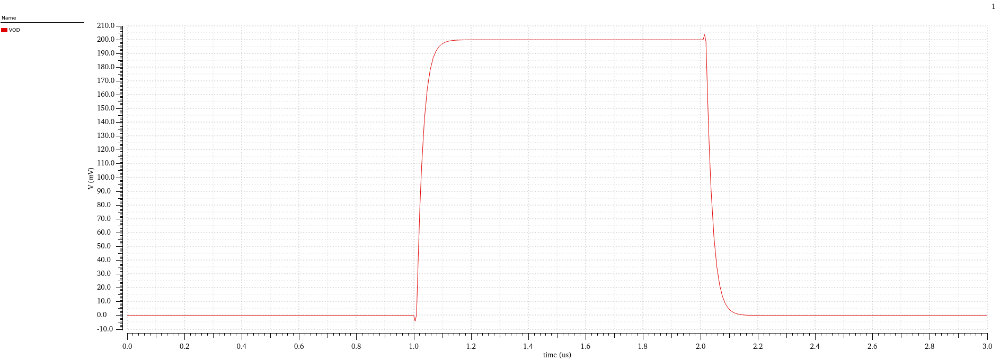<br><sub>V<sub>od</sub>, pulse input</sub></td>
    <td align="center" colspan="3">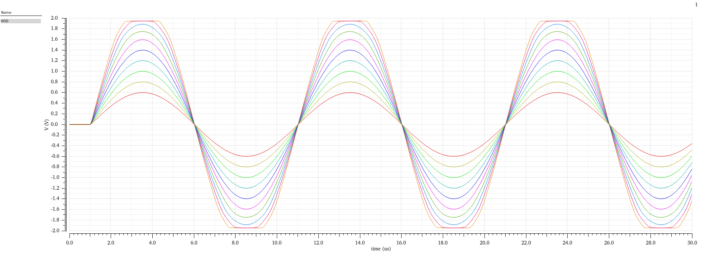<br><sub>V<sub>od</sub>, sine input</sub></td>
  </tr>
</table>

[⬆️ Back to top](#readme)

---

## <a id="design-challenges"></a>🏆 Design challenges

### 🔌 Full-custom rail-to-rail op-amp (65 nm)

**📄 Report:** [`op-amp.pdf`](design-challenges/op-amp/report/op-amp.pdf) · **📑 Paper:** [`hogervorst1994.pdf`](design-challenges/op-amp/paper/hogervorst1994.pdf)

A full-custom two-stage CMOS op-amp based on the compact rail-to-rail topology of Hogervorst et al. (IEEE JSSC, 1994): complementary input pairs and a **floating class-AB output stage biased by a Monticelli-type translinear loop**, which keeps the noise and offset of the class-AB bias low without extra bias sources.

<table align="center">
  <thead>
    <tr>
      <th align="center">Item</th>
      <th align="center">Value</th>
    </tr>
  </thead>
  <tbody>
    <tr>
      <td align="center">🔬 Technology and supply</td>
      <td align="center">65 nm CMOS, 2.5 V</td>
    </tr>
    <tr>
      <td align="center">🔌 Load</td>
      <td align="center">R<sub>L</sub> = 20 kΩ, C<sub>L</sub> = 20 pF</td>
    </tr>
    <tr>
      <td align="center">🎯 Targets</td>
      <td align="center">A<sub>ol</sub> &gt; 60 dB, PM &gt; 60°, GBW &gt; 10 MHz</td>
    </tr>
    <tr>
      <td align="center">🌡️ Verification</td>
      <td align="center">Process corners TT, FF, SS, FS, SF and temperature −40 °C to 125 °C</td>
    </tr>
    <tr>
      <td align="center">📐 Sizing rules</td>
      <td align="center">Input pairs L = 300 nm, gm/ID = 20. Current sources L = 1 µm, gm/ID = 10. Cascodes L = 0.5 µm, gm/ID = 15. Mirror ratio m = 4</td>
    </tr>
  </tbody>
</table>

Two ways of biasing the cascode transistors were built and compared:

<table align="center">
  <thead>
    <tr>
      <th align="center"></th>
      <th align="center">Shared cascode bias</th>
      <th align="center">Independent-branch bias</th>
    </tr>
  </thead>
  <tbody>
    <tr>
      <td align="center">Compensation C<sub>M</sub></td>
      <td align="center">1.4 pF</td>
      <td align="center">0.7 pF</td>
    </tr>
    <tr>
      <td align="center">A<sub>ol</sub> (TT)</td>
      <td align="center">65.78 dB</td>
      <td align="center">80.64 dB</td>
    </tr>
    <tr>
      <td align="center">GBW (TT)</td>
      <td align="center">10.67 MHz</td>
      <td align="center">13.28 MHz</td>
    </tr>
    <tr>
      <td align="center">Phase margin (TT)</td>
      <td align="center">60.39°</td>
      <td align="center">64.31°</td>
    </tr>
    <tr>
      <td align="center">Area / cost</td>
      <td align="center">Compact (367.95 µm²)</td>
      <td align="center">Larger and more current</td>
    </tr>
    <tr>
      <td align="center">Across corners</td>
      <td align="center">Bias points more sensitive to process</td>
      <td align="center">Steadier, but some corners still miss the specs (for example FF PM = 54.1°, SS GBW = 5.1 MHz)</td>
    </tr>
  </tbody>
</table>

The op-amp was also checked as an **inverting** amplifier (gain −1), a **non-inverting** amplifier (gain ×2), and an **integrator** (R<sub>F</sub> = 20 kΩ, C<sub>F</sub> = 20 pF at 200 kHz, giving the expected 90° shift and gain of about 2).

**💡 Takeaway:** sharing one cascode mirror saves area and power, while independent branches cost more but hold up better across corners. A few corner cases landed just short of the specs, so there is still headroom in the compensation and sizing.

<table align="center">
  <tr>
    <td align="center" colspan="2">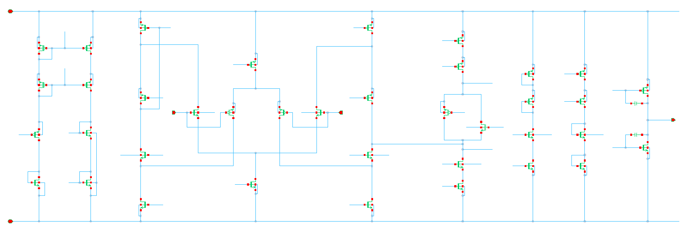<br><sub>Shared bias circuit</sub></td>
    <td align="center" colspan="2">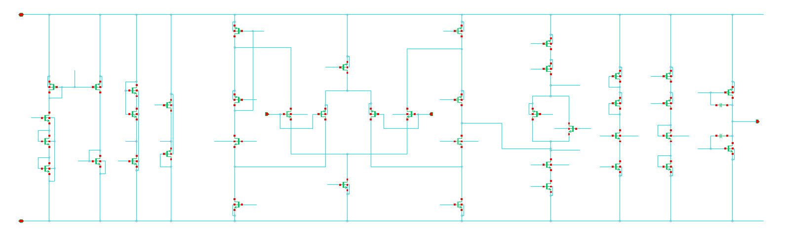<br><sub>Independent bias circuit</sub></td>
    <td align="center" colspan="2">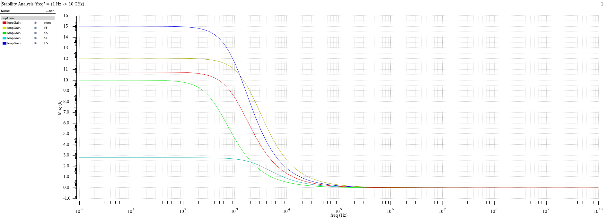<br><sub>Loop gain (LG)</sub></td>
  </tr>
  <tr>
    <td align="center" colspan="3">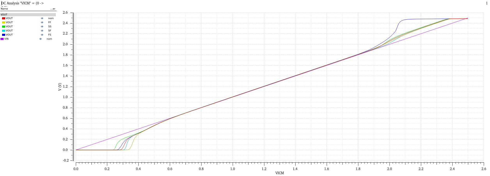<br><sub>V<sub>OUT</sub> vs V<sub>ICM</sub></sub></td>
    <td align="center" colspan="3">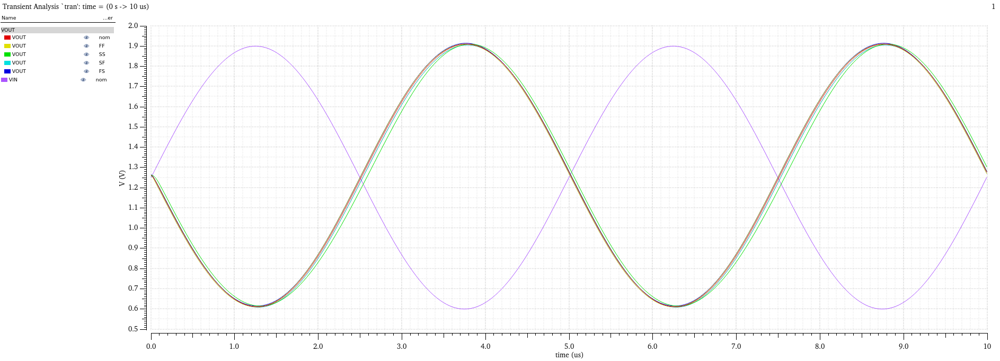<br><sub>Current, sine input</sub></td>
  </tr>
</table>

### 🌡️ Bandgap reference (BGR)

**📄 Report:** [`BGR.pdf`](design-challenges/BGR/report/BGR.pdf)

A bandgap reference designed first with an **ideal error amplifier**, then with an **actual error amplifier** (NMOS input pair W/L = 30/20, PMOS load 80/1, tail 8.4/1.97) and a start-up circuit.

<table align="center">
  <thead>
    <tr>
      <th align="center">Item</th>
      <th align="center">Ideal error amp</th>
      <th align="center">Actual error amp</th>
    </tr>
  </thead>
  <tbody>
    <tr>
      <td align="center">BJT ratio / ΔV<sub>BE</sub></td>
      <td align="center">n = 24, 82.6 mV</td>
      <td align="center">same</td>
    </tr>
    <tr>
      <td align="center">Resistors</td>
      <td align="center">R2 ≈ 165 kΩ, R3 = 1194.2 kΩ, R4 ≈ 766.5 kΩ</td>
      <td align="center">tuned (PMOS 0.62/5.5)</td>
    </tr>
    <tr>
      <td align="center">V<sub>REF</sub> variation, −40 °C to 125 °C</td>
      <td align="center"><b>0.82 mV</b></td>
      <td align="center"><b>5.8 mV</b> around ≈ 0.8 V</td>
    </tr>
    <tr>
      <td align="center">Phase margin</td>
      <td align="center">n/a</td>
      <td align="center">91.35°</td>
    </tr>
  </tbody>
</table>

<table align="center">
  <tr>
    <td align="center">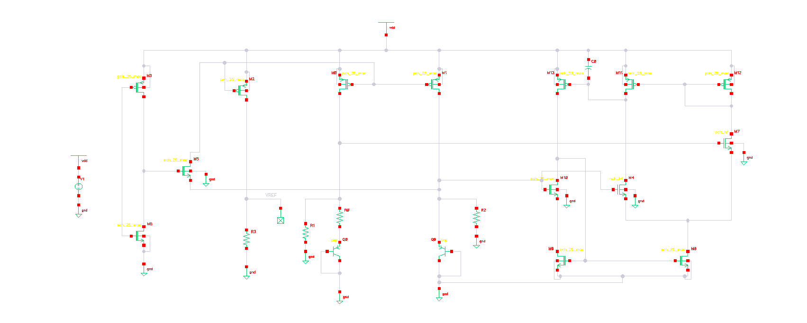<br><sub>BGR</sub></td>
    <td align="center">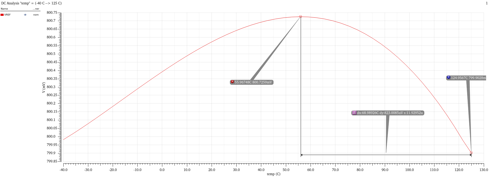<br><sub>V<sub>REF</sub> vs temperature</sub></td>
  </tr>
</table>

[⬆️ Back to top](#readme)

---

## <a id="noise-assignment"></a>🔊 Noise assignment

**📄 Report:** [`noise-assignment.pdf`](noise-assignment/noise-assignment.pdf)

Hand analysis of Example 9.10 (Section 9.4.1) from Johns & Martin: the total output noise of a 10 kHz low-pass filter built around an op-amp (C<sub>f</sub> = 160 pF, R<sub>f</sub> = 100 kΩ, R<sub>1</sub> = 10 kΩ, R<sub>2</sub> = 9.1 kΩ). The op-amp voltage noise, both noise currents, and the resistor thermal noise are combined by superposition, and each part is shaped by its own transfer function.

<p align="center">
  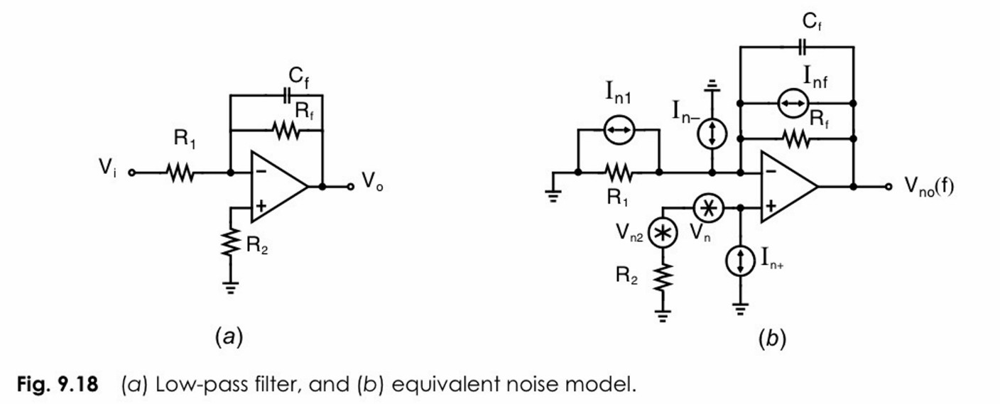<br>
  <sub>The problem statement</sub>
</p>

<table align="center">
  <thead>
    <tr>
      <th align="center">Result</th>
      <th align="center">Value</th>
    </tr>
  </thead>
  <tbody>
    <tr>
      <td align="center">Noise from the inverting-terminal sources</td>
      <td align="center">18.5 µV<sub>rms</sub></td>
    </tr>
    <tr>
      <td align="center">Noise from the non-inverting-terminal sources</td>
      <td align="center">74.6 µV<sub>rms</sub></td>
    </tr>
    <tr>
      <td align="center"><b>Total output noise</b></td>
      <td align="center"><b>76.86 µV<sub>rms</sub></b></td>
    </tr>
    <tr>
      <td align="center"><b>SNR</b> for a 100 mV<sub>rms</sub> input (1 V<sub>rms</sub> output)</td>
      <td align="center"><b>82.3 dB</b></td>
    </tr>
  </tbody>
</table>

[⬆️ Back to top](#readme)

---

## <a id="design-methodology"></a>🧭 Design methodology

Every design here follows the **gm/ID methodology**, using ADT for the charts:

1. 📋 **Derive the specs** into circuit requirements (for example, static gain error gives the loop gain, and settling time gives the GBW).
2. 🎚️ **Pick L and gm/ID (or V\*) for each transistor by its role** instead of guessing W.
3. 📊 **Read the design point** from ADT charts (gm/g<sub>ds</sub>, I<sub>D</sub>/W, f<sub>T</sub>, V<sub>GS</sub>). These barely depend on width, so W follows from the current.
4. 🪞 **Check mismatch and λ** for mirrors, then set the mirroring ratio and area.
5. ✅ **Verify in the simulator** (OP, AC, loop gain, transient, noise), compare against hand calculations, then tune.
6. 🌪️ **Stress it** across corners, temperature, and Monte Carlo where it matters.

Rules of thumb used throughout the reports:

<table align="center">
  <thead>
    <tr>
      <th align="center">Device role</th>
      <th align="center">L</th>
      <th align="center">gm/ID</th>
      <th align="center">Why</th>
    </tr>
  </thead>
  <tbody>
    <tr>
      <td align="center">Input pair</td>
      <td align="center">Short (about 300 nm)</td>
      <td align="center">High (15 to 20 µS/µA, moderate/weak inversion)</td>
      <td align="center">Maximizes GBW, minimizes input capacitance</td>
    </tr>
    <tr>
      <td align="center">Current sources and mirrors</td>
      <td align="center">Long (about 1 µm)</td>
      <td align="center">About 10 µS/µA (strong inversion)</td>
      <td align="center">Large g<sub>m</sub> does not help gain but adds offset and noise</td>
    </tr>
    <tr>
      <td align="center">Cascodes</td>
      <td align="center">Moderate (about 0.5 µm)</td>
      <td align="center">About 15 µS/µA</td>
      <td align="center">Large g<sub>m</sub> helps gain and does not add noise</td>
    </tr>
    <tr>
      <td align="center">Tail current source</td>
      <td align="center">Long</td>
      <td align="center">Low</td>
      <td align="center">Large R<sub>SS</sub> gives high CMRR</td>
    </tr>
  </tbody>
</table>

[⬆️ Back to top](#readme)

---

## <a id="tools-and-technologies"></a>🧰 Tools and technologies

<p align="center">
  
</p>

<table align="center">
  <thead>
    <tr>
      <th align="center">Purpose</th>
      <th align="center">Tool</th>
    </tr>
  </thead>
  <tbody>
    <tr>
      <td align="center">📐 Transistor sizing (gm/ID)</td>
      <td align="center"><b>ADT</b>, Analog Designer's Toolbox</td>
    </tr>
    <tr>
      <td align="center">🖥️ Schematic capture and simulation</td>
      <td align="center"><b>Cadence Virtuoso</b></td>
    </tr>
    <tr>
      <td align="center">🔓 Open-source schematic and simulation</td>
      <td align="center"><b>xschem</b> with <b>ngspice</b></td>
    </tr>
    <tr>
      <td align="center">📈 Waveform visualization (with xschem only)</td>
      <td align="center"><b>Spice Station</b></td>
    </tr>
  </tbody>
</table>

<table align="center">
  <thead>
    <tr>
      <th align="center">Technology</th>
      <th align="center">Used for</th>
    </tr>
  </thead>
  <tbody>
    <tr>
      <td align="center"><b>GF180 (180 nm)</b></td>
      <td align="center">Labs, Project 1 (1.8 V) and Project 2 (2.5 V)</td>
    </tr>
    <tr>
      <td align="center"><b>65 nm</b></td>
      <td align="center">Op-amp design challenge (2.5 V)</td>
    </tr>
  </tbody>
</table>

> ⚠️ Capacitance values from xschem were not accurate in the CD-buffer lab, so device capacitances were taken from ADT instead.

[⬆️ Back to top](#readme)

---

## <a id="references"></a>📚 References

- 📘 B. Razavi, *Design of Analog CMOS Integrated Circuits*.
- 📗 D. Johns and K. Martin, *Analog Integrated Circuit Design* (2012). Used for the CD-buffer compensation network (Section 4.4) and the noise assignment (Example 9.10, Section 9.4.1).
- 📙 A. Sedra and K. Smith, *Microelectronic Circuits*.
- 📄 R. Hogervorst, J. Tero, R. Eschauzier, and J. Huisingh, "Rail-to-Rail Input/Output Operational Amplifier for VLSI Cell Libraries," *IEEE Journal of Solid-State Circuits*, Dec. 1994. Copy in [`Rail-to-Rail Operational Amplifier`](design-challenges/op-amp/paper/hogervorst1994.pdf).
- 📄 H. Omran, "Optimum Split Ratio for Folded Cascode OTA Bias Current: A Qualitative and Quantitative Study," *Designs*, 2019. Copy in [`Folded Current Splitting-ratio`](projects/project2/paper/folded_current_split.pdf).

[⬆️ Back to top](#readme)

---

## <a id="certificate"></a>🏅 Certificate

<p align="center">
  <br>
</p> 

<p align="center">
  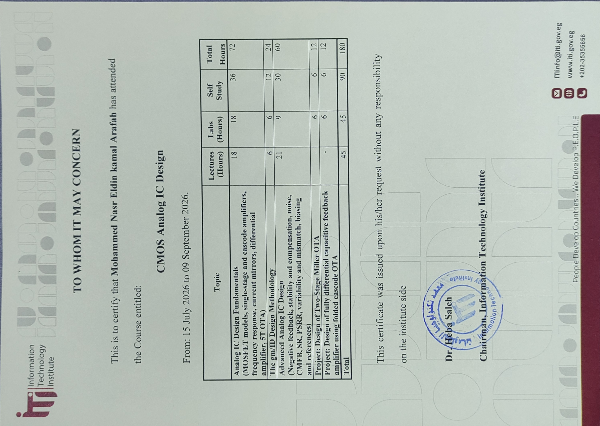
</p>

---

## <a id="license"></a>📜 MIT License

This repository is licensed under the **MIT License**. See the [`LICENSE`](LICENSE) file for the full text.

> 📌 The papers and books listed in [References](#references) belong to their respective authors and are not covered by this license.

---

## <a id="acknowledgments"></a>🙏 Acknowledgments

Thank you to **ITI** for the training program, and to **Dr. Hesham Omran** for supervising the training and for the gm/ID design methodology and the papers that shaped the mini projects.

---

## <a id="contact"></a>📬 Contact

Reach out for collaborations, discussions, or opportunities. 🤝

<table align="center">
  <tr>
    <td align="center" width="120">
      <a href="https://github.com/Mohammed-Nasr-Aldin">
        
        <br><sub><b>GitHub</b></sub>
      </a>
    </td>
    <td align="center" width="120">
      <a href="https://www.linkedin.com/in/mohammed-nasreldin">
        
        <br><sub><b>LinkedIn</b></sub>
      </a>
    </td>
    <td align="center" width="120">
      <a href="https://wa.me/201156108363">
        
        <br><sub><b>WhatsApp</b></sub>
      </a>
    </td>
    <td align="center" width="120">
      <a href="mailto:mohammednasrsmail@gmail.com">
        
        <br><sub><b>Email</b></sub>
      </a>
    </td>
  </tr>
</table>

<p align="center"><sub>© Mohammed Nasr Eldin · Built with passion for Analog IC Design &amp; Engineering</sub></p>
